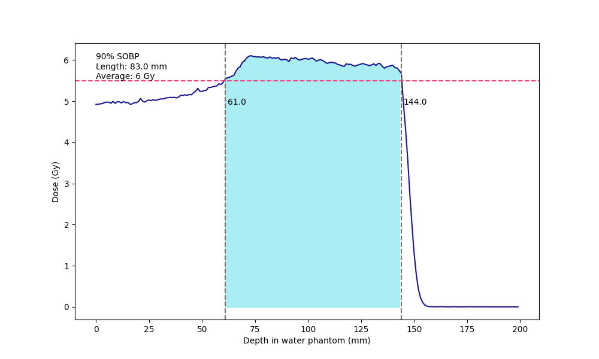

Proton Therapy Simulation Tool
-------------
The ProtonTherapy Simulation Tool makes the TOPAS input parameter files with easy modifying parameters value and executes the TOPAS with the parameter file.

### Download

```
git cone https://github.com/Somhammer/ProtonTherapy.git
```

### Requirement:
* matplotlib
* pydicom
* numpy
* pandas
* openpyxl
* xlrd

### Setup:
It writes your directory path in topas parameters files as absolute path. 
Because the relative path makes an error during running the TOPAS, please, run this setup script.

```
./setup.sh
```

This tool is based on python3, therefore, setting up the virtual environment is better.

#### Conda environment
1. Download anaconda installation file in [Anaconda](https://www.anaconda.com/products/individual#download-section)
2. Open the installation file.

```
bash Anaconda3-2020.11-Linux-x86_64.sh
```

3. Install conda following the message in the terminal
4. Initialize conda. If you type 'yes' after installation, conda is initialized automaticcaly. If not, follow the message in the terminal.
5. Conda base is activated automattically after the installation. You can deactivate this by following command.

```python
conda config --set auto_activate_base false
```

6. Create and activate the virtual environment

```python
conda update -n base -c defaults conda # update conda
#conda create -n {name} python={version}
conda create -n py39 python=3.9 # make conda environment
conda activate py39 # activate conda
conda deactivate # deactivate conda
```

#### Installation of required packages

Before installation of required packages, activate conda environment.

```python
conda install matplotlib
conda install -c conda-forge pydicom
conda install numpy
conda install pandas
conda install openpyxl
conda install xlrd
```

### Usage
#### Calculation of dose scaling factor
To fit between the patient and MC data, the scale of dose of MC should be applied.
This package requires the CT, RT, RS, RD and convAlgo files.
* CT: the patients computer tomography image files.
* RT: the radio therapy plan file.
* RS: the radio therapy structure file.
* RD: the radio therapy dose file.
* ConvAlgo(Convenient algorithm): Matching parameters between the plan and treatment machine.
After preparing these files, write the parameters in prod/doseSimulation\_cfg.py

```python
# In the cfg file, you should fill the parameter dictionary.
parameters = {
  "virtualSID":230,
  "DoseScalingF":10000, # It is inserted in the reading phase space file.
  "nNodes": 0, # Number of threads
  "nHistory": 2000, # Number of history of MC
  # Relative path from data directory
  "DicomDirectory":"Patient",
  "ConvAlgo":"Patient.xls",
  # Relative path from prod directory
  "Output":datetime.today().strftime('%y%m%d')
}
```

Then, run the python with this script.

```python
python3 doseScaling_cfg.py
```

When you run this command, it makes topas input parameter file first with topas running command script.
Then, it reads the script and executes Topas.
After topas run, it draws dose vs depth plot and calculates the scaling factor.
</img>
Finally, with this scalling factor, it makes a new dicom dose file containing mc data to analyze the plan.

##### Instances
###### set\_parameter
It reads dicom files and calculate the parmeters for writting the Topas input files.
###### write\_scripts
It writes the Topas input file and command script.
* return
  - para: it stores the number of beams and dose simulation output file names.
  - script: command script file name.
###### calculate\_sobp
It calculates and returns the dose scale factor to fit the mc and patient data.
The scale factor is calculated between the middle of the SOBP +- length.
* parameter
  - files: Dose data files from TOPAS simulation.
           It should contains dose data for each position.
           The data structure for each line is 'x y z dose'.
  - per: The criteria of SOBP. Unit is percent.
  - length: The range of average from middle of SOBP. Unit is millimeter.
  - scale\_opt: Scale factor of dose plots. Available options is following:
    + dsf(default): dose is scaled by the dose scale factor.
    + percent: dose is scaled by maximum dose.
    + para: dose is scaled by a number. Write flot number not 'number' string.
* return
  - Dose vs Depth in water phantom plot image files
  - Dose scale factors
###### postprocess
It saves a new dicom dose file containing mc data.
* parameter
  - parafile: parameter file which was made before by set\_parameter
  - sclae: dose scale factors caculated by calculate\_sobp

### Others 
##### config.py
* Proton
It loads module in src folder and runs the instances in module.
  - load(self, module): It loads the module
  - process(self, name): It runs the instance called name.
  - Usage

```python
# prod/doseSimulation_cfg.py
# Loading module 'dose_simulation'
proton = cfg.Proton()
proton.load('dose_simulation') 
instance = proton.process('DoseSimulation')(parameters) # initialize

# Run the instance
instance.set_parameters()
para, script = instance.write_scripts() 
```
* Topas
It executes topas command
  - run(self, cmd): run the commands. Input type can be str or list.
  - Usage

```python
topas = cfg.Topas()
with open(script, 'r') as f: # read script file
    cmd = f.readlines()
topas.run(cmd)
```

#### getconvalgo.py
It stores the machine's information. You can call the information like conv.modulator.

#### Directories
* src: python code directory
* data: 
  - Patient's dicom files are saved.
  - Proton therapy machine's geometry is saved.
  - Dicom structure is saved. 
* templates:
  - Topas parameter templates are saved. You can make custom topas structure using this templates. 
* prod
  - Configuration files and output are in this directory.

### Customization


