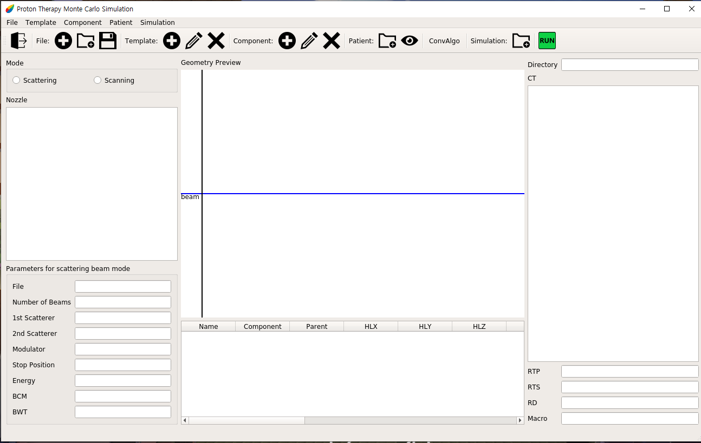
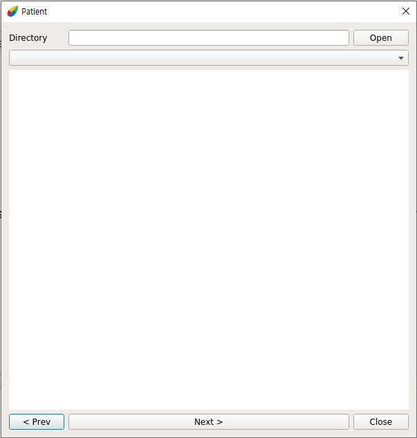

Proton Therapy
-------------
ProtonTheray는 TOPAS 실행에 사용할 텍스트 파일을 쉽게 만들거나 바꿀 수 있게 하는 프로그램입니다.

한국어 설명서: [한국어](https://github.com/Somhammer/ProtonTherapy/blob/main/README_KR.md)

영어 설명서: [English](https://github.com/Somhammer/ProtonTherapy/edit/main/README.md)

### 다운로드

```
git cone https://github.com/Somhammer/ProtonTherapy.git
```

### 설치
#### Python
ProtonTherapy를 실행하기 위해서는 python이 필요합니다. 개발과 테스트는 python 3.9에서 이루어졌습니다.

#### 라이브러리들
ProtonTherapy는 다음의 라이브러리들을 사용합니다.

* pyqt5
* pydicom
* numpy
* matplotlib
* pandas
* openpyxl
* xlrd
* yaml

pip을 이용한다면 쉽게 위 라이브러리들을 설치할 수 있습니다. 또한 pip은 다음과 같이 사용합니다.

```
# 사용법 : pip install libraries
pip install pyqt5 pydicom numpy matplotlib pandas openpyxl xlrd pyyaml
```

#### Anaconda 가상환경에서 샤용하기
Python의 버전과 라이브러리 관리를 위해서 Anaconda를 이용할 수 있습니다. Anaconda는 다음 주소에서 다운로드 할 수 있습니다. (https://www.anaconda.com/products/individual#download-section)

Anaconda의 설치는 다음 문서를 참고할 수 있습니다.(https://docs.anaconda.com/anaconda/install/index.html)

만약 본인의 운영체제가 리눅스라면 다음 커맨드로 쉽게 설치 파일을 실행할 수 있습니다.

```
bash Anaconda3-2020.11-Linux-x86_64.sh
```

만약 설치 후 Anaconda가 터미널을 열 때 마다 자동으로 실행된다면 다음 커맨드를 실행하면 됩니다.

```python
conda config --set auto_activate_base false
```

Anaconda 가상환경은 다음과 같이 설정합니다.

```python
# Anaconda 업데이트
conda update -n base -c defaults conda
# 가상환경 생성 명령어: conda create -n {가상환경 이름} python={Python 버전}
# 입력시 중괄호({,})는 제거하고 입력해주세요.
conda create -n py39 python=3.9
# 가상환경 활성화
conda activate py39
# 가상환경 비활성화
conda deactivate
```

가상환경을 활성화 했다면, 필요한 패키지들을 다음과 같은 방법으로 설치할 수 있습니다.

```python
conda install pyqt5
conda install matplotlib
conda install -c conda-forge pydicom
conda install numpy
conda install pandas
conda install openpyxl
conda install xlrd
conda install pyyaml
```

또는, ProtonTherapy 폴더에 있는 setup.yml을 이용해 가상환경을 구축하면 됩니다.

```python
conda env create --file setup.yaml
```

### 둘러보기
ProtonTherapy는 노즐 견본을 가져와서 값들을 변경하고 저장 할 수 있다. 값들은 직접 변경하거나 유저가 작성한 플러그인을 사용해 바꿀 수 있다. 이렇게 만들어진 노즐 구성요소들은 prod 폴더 안에 저장이 된다. 그리고 저장된 노즐들은 TOPAS의 input으로 들어갈 수 있다.
#### Main
</img>
Main 창은 메뉴, 툴바, 노즐 형태, 노즐 견본, 미리보기, CT 파일으로 구성되어 있다.

ProtonTherapy의 기능들을 툴바를 기준으로 설명을 하겠다.
먼저 툴바에서 보이는 맨 왼쪽의 버튼은 종료 버튼이다. 누를 경우 프로그램이 종료된다.
종료 버튼 오른쪽의 파일(File) 메뉴에는 New, Open, Save가 있는데 New는 새로운 노즐을 만드는 기능이다. 버튼을 누를 경우 기존에 만들던 노즐은 사라지고 새 창이 나타나게 된다.
그리고 ProtonTherapy는 저장기능을 제공하는데 Save를 눌러 저장하는 경우 저장 시점까지 만든 노즐 구성요소들이 .nzl형식으로 저장된다. 이렇게 저장된 노즐 구성요소는 Open을 이용해 불러올 수 있다.
그 다음은 견본(Template) 메뉴인데 New, Modify, Delete가 있다. 
New를 누를 경우 선택한 노즐 형태에 맞춰 견본 창이 뜨게 되고 여기서 새로운 노즐 견본을 만들 수 있다. 그리고 이미 만들어져 Nozzle 창에 뜬 견본을 누르고 Modify를 누를 경우 다시 견본 창이 뜨고 여기서 수정을 할 수 있다. 그리고 노즐 견본을 선택한 후 Delete 버튼을 누르면 해당 견본이 삭제된다. Modify, Delete의 경우 노즐 견본을 누르고 마우스 우클릭을 해서 나오는 메뉴를 선택해서 작업할 수도 있다.

다음으로는 구성요소(Component) 메뉴이다. 구성요소 메뉴에는 Add, Modify, Delete가 있다. 노즐 견본을 선택하고 Add 버튼 또는 마우스 우클릭 후 Add 또는 노즐 견본 더블클릭을 할 경우 해당 견본은 미리보기 창과 그 아래 표에 추가가 된다. 이렇게 추가된 견본은 구성요소가 되어 나중에 Run을 누르면 TOPAS 입력 파일에 추가가 된다.

그 다음은 환자 메뉴이다. 이 환자 메뉴에서는 환자의 dicom 파일을 추가할 수 있다. 그리고 이렇게 추가된 dicom파일들은 CT, RTP, RTS, RD로 나누어져 메인 창 가장 오른쪽에 표시된다. 이렇게 불러온 CT파일 목록에서 하나를 선택해 더블클릭 하거나 툴바의 환자 메뉴의 눈을 클릭하면 CT 이미지를 확인할 수 있다. 이렇게 불러온 환자 정보는 simulation 창에서 plugin을 추가할 때 이용할 수 있다. 그리고 산란 형태에서는 IBA 장비를 보조하기 위해 만들어진 Convenient Algoritm(ConvAlgo)를 추가할 수 있다. ConvAlgo를 불러올 경우 파일 이름과 관련 정보들이 좌측 하단, 노즐 견본 창 밑에 나타난다.

아래 그림은 구성요소들을 모두 불러오기 했을 때의 화면이다.
</img>

#### Template
</img>
#### Patient
</img>
#### Simulation
</img>
#### Run

### 사용방법
