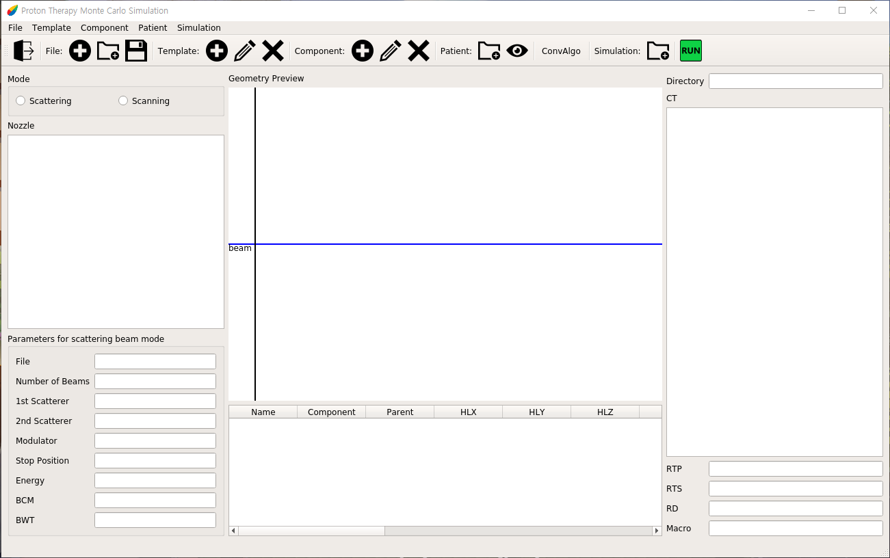

Proton Therapy
-------------
ProtonTheray는 TOPAS 실행에 사용할 텍스트 파일을 쉽게 만들거나 바꿀 수 있게 하는 프로그램입니다.

한국어 설명서: [한국어](https://github.com/Somhammer/ProtonTherapy/blob/main/README_KR.md)

영어 설명서: [English](https://github.com/Somhammer/ProtonTherapy/edit/main/README.md)

### 다운로드

```
git cone https://github.com/Somhammer/ProtonTherapy.git
```

### 설치
#### Python
ProtonTherapy를 실행하기 위해서는 python이 필요합니다. 개발과 테스트는 python 3.9에서 이루어졌습니다.

#### 라이브러리들
ProtonTherapy는 다음의 라이브러리들을 사용합니다.

* pyqt5
* pydicom
* numpy
* matplotlib
* pandas
* openpyxl
* xlrd
* yaml

pip을 이용한다면 쉽게 위 라이브러리들을 설치할 수 있습니다. 또한 pip은 다음과 같이 사용합니다.

```
# 사용법 : pip install libraries
pip install pyqt5 pydicom numpy matplotlib pandas openpyxl xlrd pyyaml
```

#### Anaconda 가상환경에서 샤용하기
Python의 버전과 라이브러리 관리를 위해서 Anaconda를 이용할 수 있습니다. Anaconda는 다음 주소에서 다운로드 할 수 있습니다. (https://www.anaconda.com/products/individual#download-section)

Anaconda의 설치는 다음 문서를 참고할 수 있습니다.(https://docs.anaconda.com/anaconda/install/index.html)

만약 본인의 운영체제가 리눅스라면 다음 커맨드로 쉽게 설치 파일을 실행할 수 있습니다.

```
bash Anaconda3-2020.11-Linux-x86_64.sh
```

만약 설치 후 Anaconda가 터미널을 열 때 마다 자동으로 실행된다면 다음 커맨드를 실행하면 됩니다.

```python
conda config --set auto_activate_base false
```

Anaconda 가상환경은 다음과 같이 설정합니다.

```python
# Anaconda 업데이트
conda update -n base -c defaults conda
# 가상환경 생성 명령어: conda create -n {가상환경 이름} python={Python 버전}
# 입력시 중괄호({,})는 제거하고 입력해주세요.
conda create -n py39 python=3.9
# 가상환경 활성화
conda activate py39
# 가상환경 비활성화
conda deactivate
```

가상환경을 활성화 했다면, 필요한 패키지들을 다음과 같은 방법으로 설치할 수 있습니다.

```python
conda install pyqt5
conda install matplotlib
conda install -c conda-forge pydicom
conda install numpy
conda install pandas
conda install openpyxl
conda install xlrd
conda install pyyaml
```

또는, ProtonTherapy 폴더에 있는 setup.yml을 이용해 가상환경을 구축하면 됩니다.

```python
conda env create --file setup.yaml
```

### 둘러보기
#### Main
</img>
#### Template
</img>
#### Patient
</img>
#### Simulation
</img>
#### Run

### 사용방법
