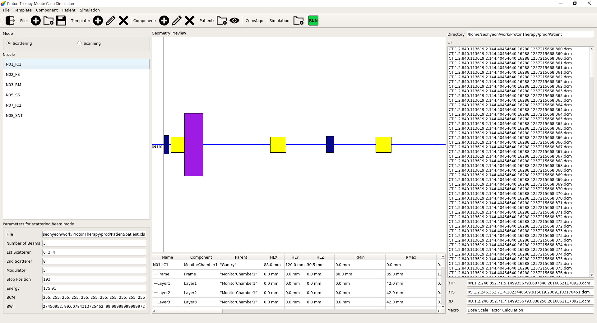

Proton Therapy
-------------
ProtonTheray는 TOPAS 실행에 사용할 텍스트 파일을 쉽게 만들거나 바꿀 수 있게 하는 프로그램입니다.

한국어 설명서: [한국어](https://github.com/Somhammer/ProtonTherapy/blob/main/README_KR.md)

영어 설명서: [English](https://github.com/Somhammer/ProtonTherapy/edit/main/README.md)

### 다운로드

```
git cone https://github.com/Somhammer/ProtonTherapy.git
```

### 설치
#### Python
ProtonTherapy를 실행하기 위해서는 python이 필요합니다. 개발과 테스트는 python 3.9에서 이루어졌습니다.

#### 라이브러리들
ProtonTherapy는 다음의 라이브러리들을 사용합니다.

* pyside6
* pydicom
* numpy
* matplotlib
* pandas
* openpyxl
* xlrd
* yaml

pip을 이용한다면 쉽게 위 라이브러리들을 설치할 수 있습니다. 또한 pip은 다음과 같이 사용합니다.

```
# 사용법 : pip install libraries
pip install pyqt5 pydicom numpy matplotlib pandas openpyxl xlrd pyyaml
```

#### Anaconda 가상환경에서 샤용하기
Python의 버전과 라이브러리 관리를 위해서 Anaconda를 이용할 수 있습니다. Anaconda는 다음 주소에서 다운로드 할 수 있습니다. (https://www.anaconda.com/products/individual#download-section)

Anaconda의 설치는 다음 문서를 참고할 수 있습니다.(https://docs.anaconda.com/anaconda/install/index.html)

만약 본인의 운영체제가 리눅스라면 다음 커맨드로 쉽게 설치 파일을 실행할 수 있습니다.

```
bash Anaconda3-2020.11-Linux-x86_64.sh
```

만약 설치 후 Anaconda가 터미널을 열 때 마다 자동으로 실행된다면 다음 커맨드를 실행하면 됩니다.

```python
conda config --set auto_activate_base false
```

Anaconda 가상환경은 다음과 같이 설정합니다.

```python
# Anaconda 업데이트
conda update -n base -c defaults conda
# 가상환경 생성 명령어: conda create -n {가상환경 이름} python={Python 버전}
# 입력시 중괄호({,})는 제거하고 입력해주세요.
conda create -n py39 python=3.9
# 가상환경 활성화
conda activate py39
# 가상환경 비활성화
conda deactivate
```

가상환경을 활성화 했다면, 필요한 패키지들을 다음과 같은 방법으로 설치할 수 있습니다.

```python
pip3 install pyside6
conda install matplotlib
conda install -c conda-forge pydicom
conda install numpy
conda install pandas
conda install openpyxl
conda install xlrd
conda install pyyaml
```
### 실행
프로그램은 src 폴더 내의 ui.py를 파이썬으로 실행하면 된다.
```python
python3 ui.py
```

### 둘러보기
ProtonTherapy는 노즐 견본을 가져와서 값들을 변경하고 저장 할 수 있다. 값들은 직접 변경하거나 유저가 작성한 플러그인을 사용해 바꿀 수 있다. 이렇게 만들어진 노즐 구성요소들은 prod 폴더 안에 저장이 된다. 그리고 저장된 노즐들은 TOPAS의 input으로 들어갈 수 있다.
#### Main
</img>
Main 창은 메뉴, 툴바, 노즐 형태, 노즐 구성요소 견본, 미리보기, CT 파일으로 구성되어 있다.

ProtonTherapy의 기능들을 툴바를 기준으로 설명을 하겠다.
먼저 툴바에서 보이는 맨 왼쪽의 버튼은 종료 버튼이다. 누를 경우 프로그램이 종료된다.
종료 버튼 오른쪽의 파일(File) 메뉴에는 New, Open, Save가 있는데 New는 새로운 노즐을 만드는 기능이다. 버튼을 누를 경우 기존에 만들던 노즐은 사라지고 새 창이 나타나게 된다.
그리고 ProtonTherapy는 저장기능을 제공하는데 Save를 눌러 저장하는 경우 저장 시점까지 만든 노즐 구성요소들이 .nzl형식으로 저장된다. 이렇게 저장된 노즐 구성요소는 Open을 이용해 불러올 수 있다.
그 다음은 견본(Template) 메뉴인데 New, Modify, Delete가 있다. 
New를 누를 경우 선택한 노즐 형태에 맞춰 견본 창이 뜨게 되고 여기서 새로운 노즐 견본을 만들 수 있다. 그리고 이미 만들어져 Nozzle 창에 뜬 견본을 누르고 Modify를 누를 경우 다시 견본 창이 뜨고 여기서 수정을 할 수 있다. 그리고 노즐 견본을 선택한 후 Delete 버튼을 누르면 해당 견본이 삭제된다. Modify, Delete의 경우 노즐 견본을 누르고 마우스 우클릭을 해서 나오는 메뉴를 선택해서 작업할 수도 있다.

다음으로는 구성요소(Component) 메뉴이다. 구성요소 메뉴에는 Add, Modify, Delete가 있다. 노즐 견본을 선택하고 Add 버튼 또는 마우스 우클릭 후 Add 또는 노즐 견본 더블클릭을 할 경우 해당 견본은 미리보기 창과 그 아래 표에 추가가 된다. 이렇게 추가된 견본은 구성요소가 되어 나중에 Run을 누르면 TOPAS 입력 파일에 추가가 된다.

그 다음은 환자 메뉴이다. 이 환자 메뉴에서는 환자의 dicom 파일을 추가할 수 있다. 그리고 이렇게 추가된 dicom파일들은 CT, RTP, RTS, RD로 나누어져 메인 창 가장 오른쪽에 표시된다. 이렇게 불러온 CT파일 목록에서 하나를 선택해 더블클릭 하거나 툴바의 환자 메뉴의 눈을 클릭하면 CT 이미지를 확인할 수 있다. 이렇게 불러온 환자 정보는 simulation 창에서 plugin을 추가할 때 이용할 수 있다. 그리고 산란 형태에서는 IBA 장비를 보조하기 위해 만들어진 Convenient Algoritm(ConvAlgo)를 추가할 수 있다. ConvAlgo를 불러올 경우 파일 이름과 관련 정보들이 좌측 하단, 노즐 견본 창 밑에 나타난다.

아래 그림은 구성요소들을 모두 불러왔을 때의 화면이다.
</img>
노즐 구성요소 견본에는 만들어진 견본들의 이름이 표시되어있고 미리보기에는 이 견본들 중 더블클릭 등을 통해 추가한 것들만 표시가 되어있다. 그리고 아래의 표에는 각각의 구성요소들의 위치 및 크기 정보가 나와있다. ㄴ 표시가 있는 행들은 구성요소의 내부요소들이다.

#### Template
</img>

견본 창에서는 구성요소 견본들을 만들 수 있다. 견본 창은 크게 import, 변수, 미리보기 창으로 나뉘어진다.
Import 창 맨 위의 output과 type은 구성요소의 이름과 monitor chamber, scatterer, rangeModulator 등의 구성요소의 형태이다. 

아래의 import 창에서는 노즐 파일의 헤더 파일로 추가할 파일들을 선택할 수 있다. Import 버튼을 눌러 파일을 추가하면 아래 빈 창에 파일이 체크박스 형식으로 추가된다. 기본적으로 파일을 불러오면 체크박스가 체크되어있는데 만약 체크박스의 체크를 해제한다면 해당 파일은 노즐의 헤더파일로 추가되지 않는다.

그리고 변수 창에는 콤보박스가 있는데 콤보박스에 있는 구성요소의 형태를 누르면 해당 구성요소에 맞는 변수들이 창에 나타난다.
</img>

New를 누르면 빈 창이 나타나고 아래 Variable 줄을 통해서 변수를 추가할 수 있다. Load의 경우 미리 만들어진 구성요소를 불러올 수 있다.
나머지는 노즐의 기본 요소이며 선택할 경우 값이 들어가있지 않은 변수들이 나타난다.

</img>

변수 값은 변수를 우클릭 해서 Modify를 눌러 바꿔주거나 창에서 직접 바꿔주면 된다.

</img>

(우클릭해서 Modify를 눌렀을 때 나타나는 창)

위 화면은 MonitorChamber를 선택한 화면이다. 구성요소를 선택하면 탭 형식으로 각각의 내부요소들이 나타난다. 만약 필요없는 내부요소가 있다면 아래의 Delete Tab을 눌러서 지우면 되고 내부요소가 더 필요하다면 탭 이름 옆의 + 버튼을 눌러서 추가하면 된다.

</img>

추가 버튼을 눌렀을 때 나타나는 창이다. 여기서 내부요소의 형태와 이름을 결정할 수 있다.

만약 내부요소의 이름을 바꾸고 싶은 경우, 바꾸고 싶은 탭을 클릭하고 Subname에 바꿀 이름을 입력을 하고 Change 버튼을 눌러주면 된다.

이렇게 만든 내부요소들은 견본에 바로 추가되지 않는다. Append 혹은 Append all을 통해서 추가해주어야 한다. Append all은 모든 내부요소들을 한번에 추가하고 Append는 현재 탭만을 추가한다. 이렇게 추가한 내부요소들은 옆의 미리보기 창에 나타나게 된다. 
</img>

그 뒤에 Make 버튼을 누르면 메인 창에 추가되게 된다.

#### Patient
</img>

CT 파일을 불러와서 더블클릭 하거나 툴 바의 눈을 클릭하면 위와 같은 화면이 뜬다. 이 화면에서 유저는 간단하게 CT 이미지를 확인할 수 있다. Prev를 누르면 이전 CT를 보여주며 Next를 누르면 다음 CT를 불러준다.

#### Simulation
</img>

이 프로그램을 통해 만드는 TOPAS Simulation input은 phase space를 기록하고 쓰는 부분과 기타 세 부분으로 나누어진다.

Simulation 창에서는 각각의 input에 들어갈 내용을 작성할 수 있다. 기본적으로 Control, Beam, Phantom 등의 TOPAS 요소들을 추가할 수 있다. 
그리고 Select 창을 통해서 새 시뮬레이션을 만들거나 본인이 만든 plugin을 불러 올 수 있다.
Requirements 창에는 불러온 plugin이 요구하는 것들의 목록이 뜬다. 
만약 plugin에서 환자 CT와 ConvAlgo가 필요하다면 Requirements 창에 CT와 Convalgo가 표시된다. 그리고 이 요구사항들이 만족되지 않는다면 Simulation은 동작하지 않는다.

Import Files 창에는 본인이 추가한 노즐 구성요소들이 표시된다. 탭 메뉴에는 Record, Read, Others 3개가 있는데 체크박스를 통해서 각각의 input에 어떤 파일을 헤더 파일로 넣을지 정할 수 있다. 그리고 Open 버튼을 통해 새로 불러올 수 있다.

가운데 창은 Template 창과 비슷하게 구성요소를 추가하는 창이다. 이 창을 통해 만든 요소는 Append 버튼을 누르면 옆의 Simulation Components 창에 표시된다. 이 곳에 나타난 구성요소들은 아래 탭에 더블클릭을 이용해 추가할 수 있다. 더블클릭을 통한 추가는 현재 선택중인 탭에만 적용된다. 그렇기 때문에 만약 Beam Distribution 정보가 Read, Others에만 필요하다면 Record 탭을 누르고 더블클릭, Others 탭을 누르고 더블클릭하면 된다.

</img>

이렇게 구성요소를 모두 추가했으면 Save 버튼을 통해 저장할 수 있으며 모든 작업이 끝났다면 Make 버튼을 누르면 된다. 그리고 Main 창에서 툴바의 Run 버튼을 누르면 오늘 날짜로 prod 밑에 폴더가 만들어진다.

### Plugin 작성법
환자에 따라 인풋 파일에 들어가는 변수 값들이 달라지는 경우가 있다. 이것들을 처리하기 위해서 플러그인을 작성해 시뮬레이션 창에서 추가할 수 있다. 플러그인은 파이썬 클래스이며 기본적으로 plugin 폴더 내의 simulation.py에 있는 Simulation 클래스를 상속해야 한다.

```python
import plugin.simulation as sim
...
class CustomSimulation(sim.Simulation):
...
```

simulation.py 는 세 개의 데이터 클래스와 하나의 클래스로 이루어져 있다.
데이터 클래스는 CT 파일들의 정보를 담는 CTinfo, RTPinfo, RTSinfo로 이루어져 있다. 각각의 클래스는 ID 하나만 담고 있는데 유저는 이 세개의 데이터 클래스 각각을 상속해 담고 싶은 변수를 추가할 수 있다.

```python
@dataclass
class CTinfo(sim.CTinfo):
    PixelSpacing: list: list = field(default_factory=list)
    Position: list = field(default_factory=list)
    Thickness: float = None
```

이렇게 만든 데이터 클래스는 시뮬레이션 클래스 내부에서 선언해 환자 정보를 담아 전달할 수 있다.

그리고 Simulation 클래스에는 다음과 같은 함수들이 있다.

```python
__init__, is_workable, set_requirement, number_of_beams, number_of_parallels, 
set_import_files, set_templates, read_CT, read_RTP, read_RTS, set_parameters, 
change_parameters, save_filters, save_phase, run
```

__init__ 함수는 문자 그대로 클래스를 초기화 하는 함수이다. 여기에는 클래스에서 사용할 변수들이 담겨 있으며 추가할 변수들 혹은 초기값이 있다면 유저가 직접 추가할 수 있다. 특히 __init__ 함수에서 요구사항에 들어갈 것을 dictionary 형식으로 추가해줄 수 있다. dictinoary의 key로는 요구사항의 이름이 들어가며 값에는 ['파일경로', 변수] 가 리스트로 들어간다.

is_workable, set_requirement는 요구사항과 관련된 함수인데, 만약 요구사항이 만족된다면 is_workable이 True를 반환하고 run 함수가 동작할 수 있게 한다.

number_of_beams와 number_of_parallels는 beam과 parallel world의 갯수를 반환해주는 함수이다. 필요에 따라서 CT 파일들을 읽는 함수에 적용해줄 수 있다.

set_import_files, set_templates는 GUI와 통신을 해 헤더 파일과 구성요소들을 가져오는 함수이다. 이는 GUI가 자동으로 처리하니 유저는 작성할 필요가 없다.

유저가 작성해야 될 중요한 함수는 read_CT, read_RTP, read_RTS, set_parameters, save_filters이다. read_* 함수들은 각각 CT, RTP, RTS를 읽는 함수이고 여기서 담을 정보를 정해서 데이터 클래스에 넘겨주게 된다.

아래 코드는 CT파일을 읽는 예제 코드이다. pydicom을 이용해 파일을 불러오고 이 중 필요한 값들을 CTinfo 클래스를 만들어 저장한 뒤, self.CT 리스트에 붙여준다.
```python
    def read_CT(self, patient):
        if len(patient.CT) == 0: return
        self.dicom = patient.directory
        imageZ = len(patient.CT)
        firstCT_file = dicom.dcmread(os.path.join(patient.directory, patient.CT[0]))
        lastCT_file = dicom.dcmread(os.path.join(patient.directory, patient.CT[-1]))

        instance = firstCT_file.InstanceNumber
        img_thick = firstCT_file.SliceThickness
        if img_thick is None: img_thick = 0.0

        firstCT = CTinfo(
          Position = firstCT_file.ImagePositionPatient,
          Thickness = float(img_thick),
          PixelSpacing = firstCT_file.PixelSpacing,
          Rows = firstCT_file.Rows,
          Cols = firstCT_file.Columns,
          Manufacturer = firstCT_file.Manufacturer
        )
        lastCT = copy.deepcopy(firstCT)
        lastCT.position = lastCT_file.ImagePositionPatient

        if firstCT.Position[-1] < firstCT.Position[-1]:
            firstCT.Position[2] = firstCT.Position[2] + (instance - 1) * img_thick
            lastCT.Position[2] = firstCT.Position[2] - (imageZ - instance) * img_thick
        else:
            firstCT.Position[2] = firstCT.Position[2] - (imageZ - instance) * img_thick
            lastCT.Position[2] = firstCT.Position[2] - (instance - 1) * img_thick
        firstCT.Center = (firstCT.Position[2] + lastCT.Position[2]) / 2.0

        self.CT.append(firstCT)
        self.CT.append(lastCT)

```

다음은 이렇게 만든 정보들을 적용하는 과정이다.
먼저 Simulation GUI에서 구성요소들을 만들 때, 변수 값 혹은 이름 값을 i:Component/Value1 = {Value1} 중괄호로 둘러 싸서 작성을 한다.

아래는 GUI를 통해 만든 구성요소 저장파일의 일부이다.
```
      d:Tf/TimelineEnd = {Stop} ms

      i:Tf/NumberOfSequentialTimes = {nSequentialTimes}

      dv:Tf/BeamWeight/Times = {nSize} {BWT} ms

      iv:Tf/BeamWeight/Values = {nSize} {BCM}

      s:Tf/BeamCurrent/Function = "Step"

      dv:Tf/BeamCurrent/Times = 1 100 ms

      iv:Tf/BeamCurrent/Values = 1 2000

```
중괄호로 둘러싸인 Stop, nSequentialTimes, BWT 등을 set_parameter의 kwargs에 저장하면 인풋 파일을 만들 때 적용이 된다.

그리고 set_parameters에서 dictionary 형태로 중괄호에 둘러싸인 이름을 key로, 적용할 값을 value로 작성하면 자동으로 읽어 처리하게 된다.

```python
    def set_parameters():
        ...
        kwargs = {
          'nSize':f'{len(convalgo["BCM"][0])}',
          'Stop':f'{convalgo["Stop Position"][0]/256*100:.5g}',
          'BCM':'0 0 0 '+' '.join(str(convalgo['BCM'][0][i]) for i in range(3,len(convalgo['BCM'][0]))),
          'BWT':' '.join(f'{i:.5g}' for i in convalgo['BWT'][0]),
          'nSequentialTimes':int(set_value(convalgo['Stop Position'][0], ibeam)),
          'DicomDirectory': patient.directory,
        }
        ...
        return kwargs
```
이렇게 만든 kwargs는 run 함수를 통해 change_parameter에 전달되고 구성요소의 변수값들이 변하게 된다.
다른 함수로는 save_filters가 있는데 이는 Aperture나 Compensator 같은 것들을 저장하는 함수인데, 이는 유저가 직접 작성해야 한다.
